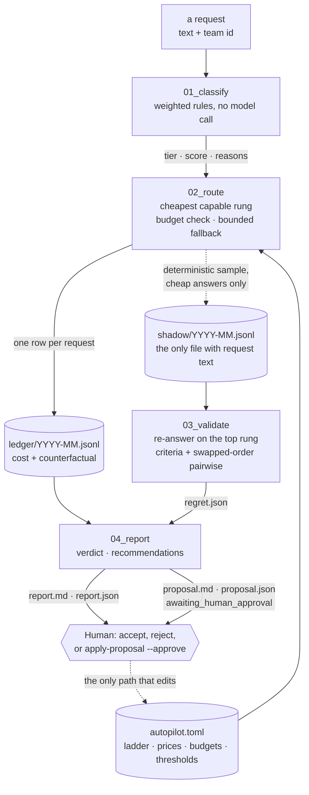

# llm-cost-autopilot

**Route every LLM request to the cheapest model that can handle it — and prove the cheap answer was good
enough.**

[](https://github.com/DreadpiratePickles/llm-cost-autopilot/actions/workflows/ci.yml)
[](.python-version)
[](LICENSE)
[](tests/)

This is a cost router with a conscience. It scores each request's complexity with transparent rules, sends
it to the cheapest rung of a model ladder that can serve it, refuses anything that would break a team's
monthly budget, and appends one audited line per request to an integer-micro-USD ledger — which also records
what that request *would* have cost on the best model, so the saving is a subtraction rather than a claim.

Then it checks its own homework. A deterministic sample of the cheap answers is re-asked on the top rung and
both answers are judged against each other, which turns "the cheap model was fine" into **routing regret**:
the share of sampled cheap answers that were not good enough, with a 95% interval, per rung and per tier.
Validation costs money too, and that cost is printed next to the saving rather than netted out of it.

## Contents

[The problem](#the-problem-in-20-seconds) · [What it does](#-what-it-does) · [Why it's worth
using](#-why-its-worth-using) · [See the numbers](#-see-the-numbers) · [How it works](#-how-it-works) ·
[Install](#-install-5-minutes) · [Use it](#-use-it-a-guided-first-session) · [Quotas, prices and
models](#-quotas-prices-and-models) · [Configuration](#-configuration-reference) · [FAQ](#-faq) · [Project
layout](#-project-layout) · [Design principles](#-design-principles) · [Status and
roadmap](#-status-and-roadmap) · [Learn from this repo](#-learn-from-this-repo) ·
[Contributing](#contributing) · [License](#license)

## The problem, in 20 seconds

A team ships a feature on the best model in the account, because that is the safe default and nobody has
time to think about it per request. Six months later the bill is five figures a month, and most of the
traffic turns out to be "reformat this", "what is the order number in this blurb", "translate this line" —
work a model costing a twentieth as much would do perfectly.

**Routers already exist**, and they are not hard to write: a hundred lines and a regex will get you most of
the way. **The hard part is the sentence after.** A router that sends everything to the cheapest model saves
90% and is indefensible. A router that saves 50% might be excellent or might be quietly shipping worse answers to a
fifth of your users, and *the router cannot tell you which*, because nothing in it ever looked at an answer.
The saving lands in a dashboard; the cost lands somewhere nobody is measuring.

So a cost figure without a matching quality figure is half a number. This tool's whole reason to exist is
the other half: **routing regret**, measured on a deterministic sample, reported with a confidence interval,
with the price of measuring it stated in the same units next to the saving it qualifies.

## 🔧 What it does

Five steps. Each one writes a file you can read, keep and check with a calculator.

1. **Classify** — score the request's complexity from its text alone with a transparent weighted sum, and
   assign a tier. No model is called, and every term that fired is recorded as a reason carrying its own
   weight. → `Classification`, copied onto the ledger row
2. **Route** — take the cheapest rung the ladder permits for that tier, check the team's monthly budget
   *before* calling anything, call the model, step up one rung on a transient failure, and price the call in
   integer micro-USD. → `ledger/<YYYY-MM>.jsonl`, one row per request whatever happened
3. **Validate** — for a deterministic sample of the cheap answers, re-ask the same request on the top rung
   and judge the two answers both against the request's criteria and pairwise in both orders. →
   `shadow/<YYYY-MM>.jsonl`, `validate/<YYYY-MM>/verdicts.jsonl`, `regret.json`
4. **Report** — turn the month into one verdict, with spend broken down three ways, regret per rung and per
   tier with Wilson intervals, what the measurement cost, and deterministic recommendations that each name
   their evidence and one specific action. → `report/<YYYY-MM>/report.md`, `report.json`
5. **Propose** — write the exact `autopilot.toml` diff those recommendations imply, marked
   `awaiting_human_approval`, and stop. → `report/<YYYY-MM>/proposal.md`, `proposal.json`

What you get: a saving you can check by subtraction, because every row carries both halves; a regret rate
with a 95% interval per rung and per tier, and a one-line verdict in one of four wordings rather than a bare
percentage; the price of the measurement, split into reference and judge legs, next to the saving it
qualifies; and a tuning diff somebody has to sign. No account, no dashboard, no vendor holding your spend
history.

## 💡 Why it's worth using

**Regret, not accuracy.** The question a routing decision has to answer is comparative: *would a better
model have done better here?* So every judgement is a comparison against a reference answer from the rung
the router declined to use, and a criterion both models fail contributes nothing. Every rate travels with a
Wilson interval, and a tier is `safe` only when the interval's **upper** bound is under the threshold.
Twelve samples with zero regret is not `safe`; it is "no regret observed (n=12); interval too wide — need
~23 more clean samples", which is a different sentence with a different action attached.

**A classifier you can argue with.** Tier comes from a weighted sum of measurable features — length bands,
code fences, stack traces, tables, task verbs from two fixed vocabularies, constraint markers, multi-step
markers, non-ASCII share — and every term that fires appends a reason carrying its own weight, which sum
exactly to the score. A ledger row saying `contains a stack trace (+25), reasoning verb(s): debug (+14)` is
a rule you can point at and fix. `T3_COMPLEX because a model said so` is not.

**Integer money, bounded fallback, three outcomes that never blur.** Every amount is an `int` of micro-USD
with an explicit currency, and every division rounds up, because a million one-token calls must not be free;
the counterfactual is stored per row rather than recomputed later, so a saving stays checkable after the
vendor's prices change — which they will. A transient failure steps up exactly one rung, at most once per
remaining rung, never wrapping; a rejected credential or a malformed reply stops immediately, because a
dearer model fixes neither. The budget check is `spend >= cap` against the month's ledger *before* any call,
and a refusal is a recorded row costing zero rather than an exception nobody sees. `ok`, `refused` and
`failed` never decay into one another, so the row count is the request count, not the success count.

**Proposals need a human.** The tool computes the exact config diff and then stops. Auto-tuning would be a
system grading its own work and then acting on the grade, on evidence from a judge in the same model family
as the answers, with a month-long feedback period and no damping. "Humans approve anything that spends" is
also just good control theory here.

**It composes with the project before it.** The provider protocol, the typed error hierarchy, the retry
policy, the pacing helper, the criterion judge with its strict parser, and `wilson_interval` are imported
from [project 1](https://github.com/DreadpiratePickles/model-regression-detection), pinned to commit
`5c1fa8b`, rather than restated — so the two cannot drift on what counts as a transient failure or on how
wide a 95% interval is. This project adds the *metered* seam project 1 did not need: `Completion` carries
token usage, without which a call cannot be priced.

**It is honest about what it has not measured.** The judge is not calibrated, and no live regret figure has
ever been produced because the free-tier key cannot reach a top rung. Both facts are here, in
`docs/design.md`, in the stage contracts, and in the config file next to the settings they qualify — because
a cost tool that over-claims once is a cost tool nobody believes again.

## 📊 See the numbers

### The synthetic example, clearly labelled

[`docs/examples/`](docs/examples/) holds a complete run of all four stages against
[`workloads/mixed_v1.jsonl`](workloads/mixed_v1.jsonl) — 30 requests across three tiers. **It was produced
with `--dry-run`, so every verdict in it is a canned constant from an in-memory fake and every cost comes
from fixed synthetic token counts.** Each file says so on its first line, and the tool put that banner
there.

From [`summary.synthetic.txt`](docs/examples/summary.synthetic.txt):

```
  requests           30
  spend              $0.010461
  if all top rung    $0.024000
  saving             $0.013539 (56%)
  fallbacks          0     refusals  0     failures  0

  Quality (from shadow validation)
    sample_percent     20
    cheap-routed       23 successful request(s) below the top rung
    shadow-sampled     5
    validated          5
    overall regret     0 of 5 (0%)  95% CI [0.000, 0.434]
    validation cost    $0.010510 (reference $0.004000 + judge $0.006510)

    regret by tier:
    T1_TRIVIAL   n=4    regret 0 (0%)  95% CI [0.000, 0.490]
      insufficient evidence: 4 validated sample(s), fewer than min_samples 10
    T2_STANDARD  n=1    regret 0 (0%)  95% CI [0.000, 0.793]
      insufficient evidence: 1 validated sample(s), fewer than min_samples 10
```

(The three outcome counts are on separate lines in the file; folded here for space.) That block is the whole
argument of this project. The saving is 56%. The regret is zero — on five
samples, upper bound 43%, so the report says `insufficient evidence` rather than quoting the zero. And
proving even that much cost **$0.010510, or 77% of the saving**. A tool that printed only the first block
would be lying by omission.

The rendered month is [`report.synthetic.md`](docs/examples/report.synthetic.md); the diff it recommends —
`sample_percent` 20 → 100, evidence attached — is
[`proposal.synthetic.md`](docs/examples/proposal.synthetic.md).

### The live run, which did not finish

[`docs/examples/report.live.md`](docs/examples/report.live.md) is real output from a real run against real
models on 2026-09-02, using [`autopilot.demo.toml`](autopilot.demo.toml) and
[`workloads/demo_quota_v1.jsonl`](workloads/demo_quota_v1.jsonl) — a two-rung ladder and a 12-request
workload sized to fit a free-tier key's daily allowance.

**It did not complete, and that is why it is committed.** The key's 20 daily `gemini-3.6-flash` requests had
already gone to an earlier run, so `route` recorded 4 `ok` and 8 `failed`, `validate` produced two verdict
records carrying `429 RESOURCE_EXHAUSTED` verbatim and no verdict at all, and `report` exited 2: *"0
comparison(s) produced a readable verdict, fewer than [report] min_comparisons 4. Absence of evidence is not
evidence of no regret."*

A month with a 43% saving and no regret figure reports `INCONCLUSIVE` and recommends enabling billing.
Nothing was invented, no failure decayed into a success, and the row count is still 12 — the failure path
working, which is better evidence than a clean run would have been. Full account, call budget and how to get
a complete run: [`docs/runbook-live-demo.md`](docs/runbook-live-demo.md).

## 🧭 How it works



| Stage | Command | Reads | Writes | Logic lives in |
|---|---|---|---|---|
| `01_classify` | `autopilot.py classify` | the request text, `[classifier]` | nothing — in-memory `Classification` | `src/cost_autopilot/classify/` |
| `02_route` | `autopilot.py route` | the request, `[ladder]`, `[policy]`, `[budgets]`, `[run]`, `[validate]`, the month's ledger | `ledger/<month>.jsonl`, `shadow/<month>.jsonl` | `src/cost_autopilot/route/`, `ledger/` |
| `03_validate` | `autopilot.py validate` | `shadow/<month>.jsonl`, `done.jsonl`, `[validate]` | `verdicts.jsonl`, `done.jsonl`, `regret.json` | `src/cost_autopilot/validate/` |
| `04_report` | `autopilot.py report` | `ledger/<month>.jsonl`, `regret.json`, `verdicts.jsonl`, `[report]` | `report.md`, `report.json`, `proposal.md`, `proposal.json` | `src/cost_autopilot/report/` |
| — | `autopilot.py ledger summary` | `ledger/<month>.jsonl`, `regret.json` | stdout | `src/cost_autopilot/ledger/summary.py` |
| — | `autopilot.py apply-proposal` | a `proposal.json` | **`autopilot.toml`** | `src/cost_autopilot/report/apply.py` |

Only stages 02 and 03 call a model; 01 and 04 never do, under any flag. `--dry-run` on `route` and
`validate` substitutes in-memory fakes at the provider factory — the single seam every call passes through —
so no dry run can reach a vendor. On `report`, where there is nothing to stub, it means *label every
artifact synthetic*.

The four tier verdicts — `safe`, `insufficient evidence`, `no regret observed … interval too wide`, `regret
too high` — are decided and worded in exactly one function, `validate/report.py::tier_verdict_line`, which
both `ledger summary` and `report.md` render verbatim. Two commands showing the same evidence in different
words is how a reader learns to trust neither.

Each stage has a formal contract — [01](stages/01_classify/CONTEXT.md), [02](stages/02_route/CONTEXT.md),
[03](stages/03_validate/CONTEXT.md), [04](stages/04_report/CONTEXT.md) — declaring objective, inputs with
layers and authority levels, process, outputs, verification, approval gates and failure behaviour. The
reasoning behind every decision, including the ones made the other way and then reversed, is in
[`docs/design.md`](docs/design.md).

## 📦 Install (5 minutes)

### 1. Prerequisites

- **[uv](https://docs.astral.sh/uv/)** — the only thing to install by hand: `curl -LsSf
  https://astral.sh/uv/install.sh | sh` on macOS or Linux.
- **Python 3.12** — pinned in [`.python-version`](.python-version); you do not install it, uv will.
- **A Gemini API key** — the free tier is enough to see it work, though not enough to complete a validation
  run; see [Quotas, prices and models](#-quotas-prices-and-models). Get one at
  [aistudio.google.com/apikey](https://aistudio.google.com/apikey). Step 3 needs no key at all.

### 2. Clone, install, add your key

```bash
git clone https://github.com/DreadpiratePickles/llm-cost-autopilot
cd llm-cost-autopilot
uv sync
echo 'GEMINI_API_KEY=your-key-here' > .env
```

`uv sync` creates a `.venv/`, installs Python 3.12 if missing, and resolves the locked dependency set from
`uv.lock` — including project 1, pinned to a commit. `.env` is gitignored, and the key is never logged, never
in an error message, never on a ledger row. Nothing else needs configuring: model ids, prices, budgets and
thresholds all have working defaults in [`autopilot.toml`](autopilot.toml).

### 3. Verify offline — no network, no spend

```bash
uv run pytest -q
uv run ruff check .
```

776 tests, none of which touches the network. Then run the whole pipeline against canned providers — three
commands, no key, no network, nothing spent:

```bash
uv run python scripts/autopilot.py route \
  --workload workloads/mixed_v1.jsonl --team demo --dry-run --min-interval-ms 0
uv run python scripts/autopilot.py validate --dry-run --min-interval-ms 0
uv run python scripts/autopilot.py report --dry-run
```

Real output, tails only — the last line of each command:

```
Recorded 30 ledger row(s): 30 ok, 0 not ok.
Regret 0 of 5; wrote validate/2026-09/regret.json.
Validation cost $0.010510 — overhead this month's saving has to survive.

Verdict: INCONCLUSIVE
5 comparison(s) produced a readable verdict, fewer than [report] min_comparisons 10. Absence of evidence is
not evidence of no regret.
```

**Those verdicts mean nothing** — canned answers compared against canned answers — which is exactly what the
banner on the artifacts says. The only thing asserted is that the four stages wire together, and it is what
CI checks. Your own numbers will differ where sampling is involved: request ids are uuid4, so which requests
land in the 20% sample changes run to run. Artifacts go to `ledger/`, `shadow/`, `validate/` and `report/`,
all gitignored.

### Troubleshooting install

| Symptom | Cause and fix |
|---|---|
| `uv: command not found` | uv is not on your `PATH`. Re-open the shell, or see the [uv install docs](https://docs.astral.sh/uv/getting-started/installation/). |
| `uv sync` fails resolving Python | Run `uv python install 3.12` first. |
| `Configuration file not found` | You are not in the repository root, or need `--config <path>`. Every command accepts it. |
| `validate` says "No shadow records" | Nothing sampled yet. Run `route` first; check `[validate] enabled = true` and `sample_percent > 0`. |
| `report` exits 2 | Not a failure. `INCONCLUSIVE` — too few comparisons. Exit **3** is the one that means the tool could not run. |
| A live run errors about the API key | `.env` is missing, in the wrong directory, or the line is quoted. It must sit at the repository root and read exactly `GEMINI_API_KEY=...`. |
| A live run is mostly `failed` rows | Quota. See [Quotas, prices and models](#-quotas-prices-and-models), and read the vendor's error body before assuming anything is broken. |

## 🚀 Use it: a guided first session

Six steps, in order. Commands that call a model are marked; every command accepts `--config <path>`, and the
examples use the default `autopilot.toml`.

### (a) Ask why a request would be routed the way it is

```bash
# no model call
uv run python scripts/autopilot.py classify --text "What is the capital of Peru?"
```

```
tier              T1_TRIVIAL
complexity_score  0
decided_by        rules
reasons:
  - very short request: 6 words (+0)
```

Now something with a code fence and a traceback in it:

```
tier              T3_COMPLEX
complexity_score  89
reasons:
  - short request with a body: 28 words (+10)
  - contains a fenced code block (+30)
  - contains a stack trace (+25)
  - reasoning verb(s): debug (+14)
  - multi-step marker(s): root cause, step by step (+10)
```

**The weights sum to the score**, always — 10 + 30 + 25 + 14 + 10 = 89 — and that invariant is a test. If a request routes somewhere you disagree with, this
tells you which rule to argue with. Vocabularies live in
[`classify/features.py`](src/cost_autopilot/classify/features.py), weights in
[`classify/scorer.py`](src/cost_autopilot/classify/scorer.py), and the two tier boundaries in
`[classifier]`, because *where* the boundary sits is the part worth arguing about and it belongs in a file
somebody reviews.

### (b) Route — one request, then a workload

```bash
# calls the model — or add --dry-run and it does not
uv run python scripts/autopilot.py route --team demo \
  --text "Summarise this in one sentence: the shipment arrived late." --dry-run

# calls the model: one call per request, plus one per fallback
uv run python scripts/autopilot.py route \
  --workload workloads/mixed_v1.jsonl --team demo --min-interval-ms 6500
```

```
  ok       tier=T1_TRIVIAL  model=gemini-3.5-flash-lite    cost=155 micro-USD  counterfactual=800
```

`cost` is what was charged; `counterfactual` is what those exact token counts would have cost on the top
rung. Both are on the row, so the saving is always a subtraction somebody else can redo.

A workload is JSONL — `id`, `text`, and optionally `team_id`, `expected_tier` and 2–4 plain-English
`criteria`. The **whole file is validated before the first call**, so a typo on line 28 is found while
nothing has been spent rather than after twenty-seven paid ones. `expected_tier` is never shown to the
classifier.

### (c) Read the ledger

```bash
# no model call
uv run python scripts/autopilot.py ledger summary
```

Requests, spend, the counterfactual, the saving in money and percent, tokens, fallbacks, refusals, failures,
spend by team and by model, requests by tier and status — and, once the month has been validated, the
quality section in [See the numbers](#-see-the-numbers). Every figure is an integer sum of integers.

### (d) Validate the sample

```bash
# calls the model: 1 top-rung call + (2 × criteria + 2) judge calls per sampled record
uv run python scripts/autopilot.py validate --min-interval-ms 6500
```

For each sampled request this re-asks the same question on the top rung — the call the router chose not to
make — then judges the two answers two ways:

- **Against the request's criteria**, where the workload supplied them, judging the cheap and the reference
  answer *separately*. Regret means the cheap answer failed something the reference answer delivered; a
  criterion both models fail is a fact about the criterion.
- **Pairwise**, always, because most real traffic has no criteria. The pair is judged twice with the labels
  swapped, and the cheap answer is sufficient only if it wins or ties in **both** orders. Contradicting
  orders mean the verdict tracked the slot rather than the content: recorded as `position_bias_detected`,
  counted as insufficient.

It is resumable: each verdict is written and marked done as it is produced, so a run stopped by a quota or
by `--limit N` is finished by running it again, and nothing is judged or paid for twice.

### (e) Report the month, and read the proposal

```bash
# no model call
uv run python scripts/autopilot.py report --month 2026-09
```

Four files into `report/<month>/`, and the verdict, headline numbers and every recommendation on stdout. The
exit code **is** the verdict: `0` SAFE, `1` REGRET_TOO_HIGH, `2` INCONCLUSIVE, `3` could not run — 3
separate on purpose, because "we could not tell" and "the tool is broken" are different messages. A
recommendation looks like this, evidence first (wrapped here; the tool prints one line):

```
  [raise_sample_percent] T1_TRIVIAL
      evidence: n=4, regret 0 (0%), 95% CI [0.000, 0.490]
      action:   T1_TRIVIAL has 4 comparison(s), fewer than min_samples 10.
                Reaching n~35 — the smallest sample whose interval clears
                max_regret 0.100 at zero regret — needs ~31 more comparison(s),
                which at the current 20% means about 175 cheap-routed
                T1_TRIVIAL request(s); this month had 11. Raise [validate]
                sample_percent from 20 to 100.
```

No recommendation ever says "consider tuning". Each names a key, a value and the arithmetic that got there.
`proposal.md` then holds that as a diff, marked `awaiting_human_approval`, with the rules and evidence
behind every line:

```diff
 [validate]
-sample_percent = 20
+sample_percent = 100
```

Nothing has been changed: deciding whether that diff is right is your job.

### (f) Apply it, with your name on it

Without `--approve`, whatever else you pass:

```
error: refusing to change autopilot.toml without --approve. This file decides
what the system is allowed to spend; a proposal is a suggestion until a person
says otherwise.
```

Both flags, every time:

```bash
uv run python scripts/autopilot.py apply-proposal \
  --file report/2026-09/proposal.json --approve --approved-by "Bobby Meher"
```

```
Applied 1 change(s) to autopilot.toml:
  [validate] sample_percent  20 -> 100
Approved by 'Bobby Meher' at 2026-09-02T14:17:07Z; recorded in report/2026-09/proposal.json.
This changes what future requests cost. Re-run `autopilot report` next month to
see whether the evidence agreed.
```

The resulting `git diff` is **exactly one line**: the applier replaces one scalar in place rather than
round-tripping the document through a TOML writer, because half the value of that file is its comments. It
refuses in five more situations, each naming the reason: a proposal already applied, one built against a
different config file, one whose value has moved on since (naming both), one with no changes, and one naming
any key other than `[policy] <TIER>` or `[validate] sample_percent`.

## ⚠️ Quotas, prices and models

### Prices

`autopilot.toml` carries `prices_verified = true`. The three rungs' prices were read from Google's published
Gemini API pricing page on **2026-09-02** and converted to integer micro-USD per 1,000 tokens. Two caveats a
spend figure depends on:

- **The Flash and Flash-Lite rungs are on promotional pricing** that the page says rises on 2027-01-01.
  Re-read the page and update `autopilot.toml` before trusting a spend figure dated after that.
- **The top rung is `gemini-3.1-pro-preview`.** No 3.6-generation Pro model appears on the pricing page. The
  id was confirmed real by a live run (the API answers `429`, not `404`), but a preview id can be withdrawn.

If `prices_verified` is ever set to `false`, `ledger summary` and every report say so on every total,
because a cost table nobody checked is a number nobody should quote.

### The 429 taxonomy, found the hard way

The first live run failed 18 of 30 requests, and the diagnosis is the most useful operational thing in this
repository. **The vendor reports three different situations with the same HTTP status:**

| Situation | What `429` means | Does retrying help? |
|---|---|---|
| A per-minute rate limit | Slow down | **Yes** — that is what `--min-interval-ms` is for |
| A per-day quota exhausted | Come back after the reset (midnight US/Pacific) | Not today |
| **An entitlement the key does not have** | `limit: 0` — the model is paid-only | **Never** |

`gemini-3.1-pro-preview` is the third case on a free-tier key, so **a free-tier key can never reach the top
rung of the shipped ladder.** The error taxonomy inherited from project 1 maps `429` to a transient error,
so it is retried three times and then fallen back into on every request — *correct given the information
available*, since the status code genuinely is indistinguishable. It was recorded honestly: `failed` rows
naming the full fallback chain and the error type, and a summary reporting 12 requests rather than
pretending 30.

This is deliberately **not** fixed in code: parsing the vendor's quota metric out of an error string would
put vendor-specific string matching inside the error taxonomy and break the moment the wording changes. The
honest fix is operational and is written into the stage contracts — **when every request to one rung fails
transiently, read the quota metric in the vendor's error before assuming the model is unhealthy.**

Observed free-tier limits, 2026-09-02, resetting at midnight US/Pacific:

| Model | Daily limit | Role in the shipped ladder |
|---|---:|---|
| `gemini-3.5-flash-lite` | 500 | rung 0, and the default judge |
| `gemini-3.6-flash` | 20 | rung 1 |
| `gemini-3.1-pro-preview` | **0** | rung 2 — unreachable without billing |

### The quota-fit demo

Because of the above, a complete live run of the shipped ladder is impossible on a free key.
[`autopilot.demo.toml`](autopilot.demo.toml) exists for that: a two-rung ladder — Flash-Lite → Flash — with
a 12-request workload sized so the whole run costs at most **12 of the 20 daily Flash calls**. The budget is
computed in [`docs/runbook-live-demo.md`](docs/runbook-live-demo.md) and asserted in
[`tests/test_demo_config.py`](tests/test_demo_config.py), because a runbook whose arithmetic has gone stale
will make somebody burn a day's quota on its word.

Run it with `--config autopilot.demo.toml` on the same three commands as
[the guided session](#-use-it-a-guided-first-session), and read that file's header first: it accepts two
deliberate distortions (`min_samples = 4`, and rung 0's ceiling raised to `T2_STANDARD`), and its saving is
measured against Flash rather than Pro, so it is **not comparable** to a figure from `autopilot.toml`.

### Changing the ladder

Model ids live in exactly one module, [`src/cost_autopilot/config.py`](src/cost_autopilot/config.py) — not
in `autopilot.toml`, which names rungs by `model_ref`, the *name* of an environment variable. So a rung is
repointed either without a commit (`CHEAP_MODEL_ID=some-other-model uv run …`, since the environment wins
over the default) or with one, by editing a `[[ladder.rung]]` table. Both ladder invariants are checked at
load: rung indices consecutive from zero, and capability ceilings never decreasing going up — without the
second, "the first capable rung" would stop meaning "the cheapest capable rung", and the routing rule would
quietly be wrong rather than loudly rejected.

## ⚙️ Configuration reference

Everything with a consequence for money lives in [`autopilot.toml`](autopilot.toml), so changing any of it
is a diff somebody approves. **Model identifiers are deliberately absent.** Directories are relative to the
file; an absolute path is refused, because committed configuration must be portable.

### `[ladder]`

| Key | Default | Meaning |
|---|---|---|
| `prices_verified` | `true` | Whether a human has checked the prices below against the vendor's published page. `false` makes every total, everywhere, carry a warning. |
| `prices_source` | the vendor's pricing URL | Where they were read from. Recorded, not fetched. |
| `prices_read_utc` | `"2026-09-02"` | When. A promotional price with no date on it is a trap. |

### `[[ladder.rung]]` — one table per rung, cheapest first

| Key | Meaning |
|---|---|
| `model_ref` | The **name of an environment variable** defined in `config.py` — `CHEAP_MODEL_ID`, `MID_MODEL_ID`, `TOP_MODEL_ID` — never a model id. An unknown reference is an error, never silently defaulted. |
| `input_price_micro_usd_per_1k_tokens` | Integer micro-USD per 1,000 input tokens. `$0.30` per 1M tokens is `300`. |
| `output_price_micro_usd_per_1k_tokens` | The same for output. Reasoning tokens are billed as output and are counted. |
| `max_tier` | The hardest tier this rung is trusted with: `T1_TRIVIAL`, `T2_STANDARD` or `T3_COMPLEX`. A capability ceiling, not a preference. |

### `[policy]` — the per-tier *minimum* starting rung

| Key | Default | Meaning |
|---|---:|---|
| `T1_TRIVIAL` | `0` | The lowest rung index the router will **start** at for this tier. |
| `T2_STANDARD` | `0` | The effective start is the later of this and the ladder's own capability floor… |
| `T3_COMPLEX` | `0` | …so raising a number here skips cheap rungs, but lowering one can never send a tier to a rung whose ceiling is below it. |

### `[budgets]`

| Key | Default | Meaning |
|---|---:|---|
| `default_monthly_cap_micro_usd` | `2000000` | Cap for any team not listed below. `$2.00`. An unknown team gets this rather than a refusal: a new team is far likelier than an attack, and it is still capped. |
| `[budgets.teams] <team_id>` | `demo = 5000000`, `support = 1000000` | Per-team monthly cap. The check is `spend >= cap`, before any call, against the current UTC month. |

### `[classifier]`

| Key | Default | Meaning |
|---|---:|---|
| `t2_min_score` | `15` | Inclusive lower bound on the 0–100 score for `T2_STANDARD`. A score of exactly 15 is T2. |
| `t3_min_score` | `45` | Inclusive lower bound for `T3_COMPLEX`. Must be ≥ `t2_min_score`, or the file is refused. |
| `llm_classifier` | `false` | Ask the cheapest model for a tier instead of trusting the rules. Off by default and it should stay off: it spends a model call on every request, on a tool whose purpose is to spend fewer model calls, and replaces an explanation anybody can check with one nobody can. |

### `[ledger]`

| Key | Default | Meaning |
|---|---|---|
| `dir` | `"ledger"` | Where `<YYYY-MM>.jsonl` is written. |
| `log_text` | `false` | Store the full request text on every row. **Off by default** — a ledger is read by finance people, copied into spreadsheets and kept for years, and customer text does not belong in it. Rows always carry a SHA-256. |

### `[run]`

| Key | Default | Meaning |
|---|---:|---|
| `min_interval_ms` | `0` | Minimum gap between consecutive model calls in a batch. Set it to `60000 / RPM` for a per-minute quota — **6500** on this free tier. `--min-interval-ms` overrides it for one run. |
| `temperature` | `0.0` | Sampling temperature for the answer call. Zero so a re-run of the same workload is as comparable as the provider allows. Must lie in `[0.0, 2.0]`. |

### `[validate]`

| Key | Default | Meaning |
|---|---:|---|
| `enabled` | `true` | **The one setting that stores request text.** Sampled requests and their answers go to `shadow/<month>.jsonl`, gitignored and mode `0600`. Setting it to `false` costs the quality measurement and nothing else. |
| `sample_percent` | `20` | Percentage of cheap-routed requests to keep, 0–100. Sampling is `sha256(request_id) mod 100 < sample_percent`, so the same request is always sampled or always skipped, and raising the rate can only *add* requests. Directly a bill. |
| `judge_model_ref` | `"CHEAP_MODEL_ID"` | Which model judges, named by reference like a rung. **Must resolve to a model on the ladder**, or the file is refused — a judge with no price here would make the reported overhead a guess. |
| `max_regret` | `0.10` | The regret rate above which a tier is called too aggressive. Compared against the Wilson **upper** bound, never the point estimate. |
| `min_samples` | `10` | Below this many validated records a tier reports "insufficient evidence" rather than a rate. |
| `dir` | `"validate"` | Where `verdicts.jsonl`, `done.jsonl` and `regret.json` are written. Gitignored. |
| `shadow_dir` | `"shadow"` | Where the sampled text lives. Gitignored. |

### `[report]` — optional, with defaults

| Key | Default | Meaning |
|---|---:|---|
| `dir` | `"report"` | Where `<month>/report.md` and its three siblings are written. Gitignored. |
| `min_comparisons` | `10` | Fewest readable verdicts across the whole month before the report may say anything but `INCONCLUSIVE`. The month-wide twin of `min_samples`. |
| `max_fallback_rate` | `0.20` | Share of a tier's requests that may be *answered by a dearer rung after a cheaper one failed* before the report recommends starting that tier higher. |

There is deliberately **no `[report] max_regret`**: the verdict is decided against `[validate] max_regret`,
so the report and the `validate` run that fed it cannot drift apart.

### Environment variables

Names only; values belong in `.env` or a CI secret.

| Variable | Purpose |
|---|---|
| `GEMINI_API_KEY` | The provider credential. Required for any live run. Never logged, never in an error message, never on a ledger row. |
| `CHEAP_MODEL_ID` | Overrides rung 0's model id. |
| `MID_MODEL_ID` | Overrides rung 1's model id. |
| `TOP_MODEL_ID` | Overrides rung 2's model id — and the counterfactual baseline with it. |

## ❓ FAQ

**Why classify with rules instead of a model?** Three reasons, in order. It would defeat the purpose — a
model call per request, on a system whose whole job is to spend fewer model calls. It would destroy the
audit trail: `contains a stack trace (+25)` can be checked by eye, disputed and fixed at the rule that got
it wrong, while `T3 because a model said so` cannot. And it would be non-deterministic, which makes
month-over-month comparison meaningless. The cost is accuracy: against
[`workloads/mixed_v1.jsonl`](workloads/mixed_v1.jsonl) the rules agreed with the hand-assigned tier on **26
of 30** requests. The four misses are named in `docs/design.md` §3 and deliberately **not** tuned away,
because fitting two thresholds to thirty examples labelled by the same process would tell you nothing.

**Why regret rather than a pass rate?** A pass rate measures whether the answer was good. The question a
*routing* decision has to answer is comparative: would a better model have done better here? A request no
model can answer well is not a routing mistake, and counting it as one would make the metric track task
difficulty instead of routing quality.

**Why judge the pair twice with the labels swapped?** A judge asked "is A at least as good as B" does not
answer only about the answers; part of its verdict is about the slot. Position bias in pairwise LLM judging
is well documented and is large enough to invent or erase a difference on its own. One extra call per pair
turns a bias that would skew every verdict into a flag on the specific verdicts it touched. **The blind
spot, stated rather than glossed:** a judge that *uniformly* favours slot A agrees in both orders, which is
indistinguishable from a genuine tie. The swap catches contradictions, not a consistent preference. Only
calibration against hand-graded answers would catch that, and it has not been done.

**Is my request text stored?** Only with `[validate] enabled = true`, only for `sample_percent` of the
cheap-routed requests, and only in `shadow/<month>.jsonl` — gitignored, mode `0600`. **The ledger never
holds it**; rows carry a SHA-256 and a `shadow_sampled` flag, unless you explicitly set `[ledger] log_text =
true`. Setting `enabled = false` costs the quality measurement and nothing else.

**How much does validation cost?** One top-rung call plus `2 × criteria + 2` judge calls per sampled request
— 9 calls for a request with 3 criteria. In the committed synthetic example, validating 5 of 23 cheap-routed
requests cost **$0.010510** against a saving of $0.013539: **77% of the saving**, for an interval far too
wide to conclude anything from. That is the honest shape of the trade on a 30-request month, and
`sample_percent` is the dial. The figure is printed next to the saving, split into reference and judge legs,
rather than netted out of it — hiding the price of proving a saving is the accounting mistake this system
exists to catch, one level up.

**Isn't Gemini judging Gemini biased?** Yes, and it is documented rather than hidden. The default judge is
the cheapest rung, the same family that produced most of the answers, and models prefer their own output.
That points toward **under**-reporting regret — the direction that flatters the result — and it is written
into `autopilot.toml` next to the setting. Point it at another family once you have a second key.

**Why does my tier say "no regret observed … interval too wide"?** Because zero out of twelve is not
evidence: the 95% upper bound at n = 12 with zero regret is about 0.24, well above a `max_regret` of 0.10.
The line says how many more clean samples would settle it — 35 in total at that threshold, computed rather
than hard-coded, because a deployment at 0.20 needs only 16. An earlier version said "regret too high" here,
which was true of the bound and read as an accusation the data did not support; `docs/design.md` §23 has the
reversal.

**Can I use OpenAI or Anthropic?** Not today, and the seam is honest about it. `providers/metered.py`
defines a `MeteredProvider` protocol — `complete(system, user, temperature) -> Completion(text,
input_tokens, output_tokens, model_id, latency_ms)` — plus four typed errors, and **nothing outside
`src/cost_autopilot/providers/` names a vendor**. Adding one is a module implementing that protocol, a line
in `build_provider_factory`, and a price table, which is already configuration. Only a Gemini adapter is
written.

**Does it send my data anywhere, or change my config on its own?** Neither. Requests go only to the provider
you configure — no telemetry, no account, no backend, no webhook, no Slack sender — and `report` writes a
proposal marked `awaiting_human_approval` and stops.

## 🗂 Project layout

```
CONTEXT.md                          router: which stage owns which job
autopilot.toml                      the ladder, prices, budgets, thresholds — no model ids
autopilot.demo.toml                 the two-rung quota-fit ladder for a live demo
stages/*/CONTEXT.md                 01_classify · 02_route · 03_validate · 04_report contracts
.github/workflows/ci.yml            lint, tests, and the four stages offline
docs/design.md                      every decision and its reason — §1-12 A, §13-21 B, §22-26 C
docs/runbook-live-demo.md           the live demo: commands, call budget, what happened
docs/examples/                      committed report/proposal/summary, banner on line one
workloads/                          mixed_v1 (30 requests) · demo_quota_v1 (12, quota-sized)
scripts/autopilot.py                the entry point; the logic is in the package
src/cost_autopilot/
  config.py  money.py               model ids, and nothing else · integer micro-USD arithmetic
  config_file.py  workload.py       strict readers for autopilot.toml and a JSONL batch
  classify/                         features · scorer · the optional LLM classifier
  route/                            ladder · budget · router (the only stage that spends)
  ledger/                           row · append-only store · summary
  providers/                        the metered seam; the only package naming a vendor
  validate/                         sampling · shadow · pairwise · runner · regret · report
  report/                           model · build · rules · render · proposal · apply · run
tests/                              776 tests; none touches the network
ledger/ shadow/ validate/ report/   per-deployment runtime data (gitignored)
demo/                               everything autopilot.demo.toml writes (gitignored)
```

## 🧱 Design principles

- **Money is integer micro-USD.** Every amount is an `int` named `*_micro_usd` with an explicit currency;
  every division rounds up; no float touches an amount, including in rendering. This ledger is what a budget
  is enforced against.
- **Deterministic code decides; a model only answers bounded questions.** Classification, pricing and the
  verdict are all arithmetic. A model answers the user's request, produces a reference answer, or answers
  one yes/no comparison — never decides policy.
- **Model output is untrusted input, including its usage block.** A missing token count is an error, never a
  free call. An unparseable judge reply is a judge error, never a failed criterion: `True`, `False` and "no
  verdict" are three states everywhere, and a record with no verdict leaves the denominator rather than
  counting as a pass.
- **Every rate travels with its interval**, computed by project 1's `wilson_interval` rather than a second
  implementation that would eventually disagree with it about the same data.
- **Conservative in every direction it can be.** Unreadable verdicts shrink the sample rather than improving
  the rate; a pairwise contradiction counts as regret; regret is *either* signal, not both; the verdict
  compares the upper bound. Each makes the reported regret the same or higher, never lower, because this
  number exists to stop somebody claiming a saving they did not make.
- **Prices and thresholds are configuration; model ids are one module.** Tuning a threshold in response to a
  specific verdict is the same act as deleting a test.
- **Partial failure is visible**, and **nothing is applied without a person**: the strongest thing this tool
  does on its own is write a file saying what it would change.
- **A synthetic number says so before it is read** — a banner on line one, not a footnote at the bottom of a
  document people skim from the top.
- **Secrets never enter source, prompts, logs, or a ledger row**, and neither does an absolute path: a
  report is a shared document and a home directory is not part of the evidence.

## 📈 Status and roadmap

Verified locally, on this commit: **776 tests passing, 97% statement coverage, `ruff` clean**, and all four
stages run end to end offline against canned providers.

| | State |
|---|---|
| Stages 01–04, the ledger, the shadow sampler, both judges, the report and the proposal mechanism | Implemented and unit-tested |
| The four stages end to end, offline | Verified — and it is what CI runs on every push |
| Routing against live models | **Verified.** Two live runs, 2026-09-02: the shipped ladder (12 of 30 answered) and the quota-fit demo (4 of 12 answered). Both artifacts committed |
| A live **regret figure** | **Never produced.** Both live runs ended with zero readable verdicts, because no reference answer could be obtained. `docs/examples/*.synthetic.*` is canned constants and says so |
| The top rung, `gemini-3.1-pro-preview` | **Needs billing.** `429` with `limit: 0` on a free-tier key. The id is real; the entitlement is not |
| CI (`.github/workflows/ci.yml`) | Written, pinned to action SHAs, needs no secret. **Not yet observed green on GitHub** — this repository has not been pushed |
| Judge calibration | **Not done and not claimed.** No human has hand-graded a sample and checked the judge agrees. Until that happens a regret figure measures what one model thinks of another model's answer, and the stage contract blocks acting on it |
| `apply-proposal` against the committed config | Mechanism implemented and tested including every refusal; **the committed `autopilot.toml` has not been tuned by it** |

Roadmap, roughly in order of how much it would improve the answer:

- **Calibrate the judge.** Hand-grade a sample and measure agreement, watching false-passes — the direction
  in which this tool would miss real regret. Project 1's `calibrate.py` is the shape to copy.
- **A cross-family judge**, once a second provider key exists: it removes the self-preference confound that
  currently points toward under-reporting regret.
- **A live regret figure**, which needs billing enabled and about fifteen minutes of paced calls.
- **Attribute regret to the classifier rule that fired.** Every row already carries the `reasons` that chose
  its rung and every verdict the request id that joins back, so this is an aggregation rather than a
  migration — turning "T2 routing is too aggressive" into "the `words_medium` band is sending 60-word
  debugging requests to the middle rung".
- **A second provider adapter**, to prove the seam holds; and month-over-month history, since each report is
  rendered from its own month and nothing else.

## 🎓 Learn from this repo

Built as a teaching project — by Bobby Meher with Claude as pair programmer and teacher — to learn how cost
routing, LLM-as-judge and the statistics of small samples actually fit together. It is laid out to be read.

- **[`CONTEXT.md`](CONTEXT.md)** is the router: every job mapped to the stage that owns it, plus the rules
  that hold across all of them. Each stage then has its own contract ([01](stages/01_classify/CONTEXT.md),
  [02](stages/02_route/CONTEXT.md), [03](stages/03_validate/CONTEXT.md), [04](stages/04_report/CONTEXT.md))
  declaring objective, inputs with layers and authority levels, process, outputs, verification, approval and
  failure behaviour.
- **[`docs/design.md`](docs/design.md)** is the one to read if you read one. §13 argues for regret over pass
  rate; §17 has the position-bias truth table and its blind spot; §18 lists every place the arithmetic is
  deliberately conservative; §20 is the `429` taxonomy; §22 is why nothing auto-tunes; and **§23 is a
  reversal** — a decision made in Phase B, argued for at length, and overturned in Phase C when the audience
  changed.
- **[`autopilot.toml`](autopilot.toml) is itself a document.** Its comments carry the reasoning, which is
  why `apply-proposal` edits one line in place rather than rewriting the file. So do the docstrings:
  `money.py` on why not cents, `sampling.py` on why a hash rather than a random draw, `apply.py` on why the
  applier's surface is two keys.

## Contributing

Issues and pull requests are welcome, particularly on the statistics, on the classifier's weights, and on a
second provider adapter. If you disagree with the recommendation rules, [`docs/design.md`](docs/design.md)
§24 is where that argument should be had. Before opening one:

```bash
uv run ruff check . && uv run pytest -q
uv run python scripts/autopilot.py route \
  --workload workloads/mixed_v1.jsonl --team ci --dry-run --min-interval-ms 0
uv run python scripts/autopilot.py validate --dry-run --min-interval-ms 0
uv run python scripts/autopilot.py report --dry-run
```

That is exactly what [CI](.github/workflows/ci.yml) runs, and it needs no API key and spends nothing.

## License

[MIT](LICENSE).
